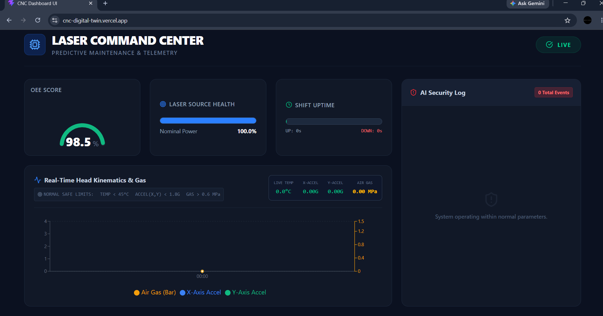

# 🏭 CNC Digital Twin

> **Real-Time Industrial IoT Monitoring & Hybrid AI Predictive Maintenance**

A full-stack Industrial IoT (IIoT) application that simulates a CNC laser cutting machine using representative industrial telemetry. The system streams telemetry through MQTT, processes and stores it using a Node.js backend and MongoDB Atlas, performs hybrid anomaly detection using rule-based logic and Isolation Forest, and visualizes machine health through a real-time React dashboard.

> **Project Evolution:** This project originally began as an ESP32-based hardware prototype using an ADXL345 accelerometer and DS18B20 temperature sensor to validate MQTT telemetry. The final implementation uses an Industrial Telemetry Simulator that replays representative CNC telemetry, enabling repeatable testing of the complete software stack without requiring continuous access to industrial hardware.

---

## 🌐 Live Demo

| Component | Link |
|----------|------|
| **React Dashboard** | https://cnc-digital-twin.vercel.app/ |

> **Note:** The dashboard is hosted on Vercel. If live telemetry is unavailable, the backend service hosted on Render may be waking up from inactivity.

---

## 📷 Dashboard



---

## 🚀 Features

- 📡 Real-time telemetry streaming using MQTT
- 🔄 Industrial Telemetry Simulator for repeatable testing
- 🌐 Node.js + Express backend
- 📊 Live React dashboard with Socket.IO
- 🗄 MongoDB Atlas telemetry storage
- 🤖 Hybrid AI anomaly detection
  - Rule-based industrial safety checks
  - Isolation Forest anomaly detection
- 🚨 Real-time alert generation
- 📈 Historical telemetry visualization
- 🏗 Event-driven microservice-inspired architecture

---

# 🏛 High-Level Architecture

```text
Industrial Telemetry Dataset
            │
            ▼
Industrial Telemetry Simulator
            │
            ▼
      HiveMQ MQTT Broker
       │             │
       ▼             ▼
 Node.js Backend   Hybrid AI Watchdog
       │             │
       ▼             ▼
 MongoDB Atlas   MQTT Alert Publisher
       │             │
       └──────┬──────┘
              ▼
       React Dashboard
```

📖 **Detailed architecture documentation:** [`docs/`](docs/)

---

# 🛠 Technology Stack

| Layer | Technologies |
|--------|--------------|
| **Frontend** | React, TypeScript, Tailwind CSS, Recharts |
| **Backend** | Node.js, Express, Socket.IO |
| **Machine Learning** | Python, Scikit-learn, Pandas, NumPy |
| **Messaging** | MQTT (HiveMQ) |
| **Database** | MongoDB Atlas |
| **Deployment** | Vercel, Render |

---

# 📂 Project Structure

```text
CNC_DIGITAL_TWIN
│
├── backend/                 # Node.js backend
├── frontend/                # React dashboard
├── ml/                      # AI Watchdog & telemetry simulator
├── docs/                    # Engineering documentation
├── images/                  # Project screenshots
├── LICENSE
└── README.md
```

---

# ⚙️ Quick Start

## 1. Clone the Repository

```bash
git clone https://github.com/Raghavsai12/CNC_DIGITAL_TWIN.git

cd CNC_DIGITAL_TWIN
```

---

## 2. Install Backend Dependencies

```bash
cd backend

npm install

npm start
```

---

## 3. Install Frontend Dependencies

```bash
cd frontend

npm install

npm run dev
```

---

## 4. Start the Hybrid AI Watchdog

```bash
cd ml

pip install -r requirements.txt

python anomaly_detector.py
```

---

## 5. Start the Industrial Telemetry Simulator

```bash
cd ml

python dataset_replay.py
```

The simulator publishes representative CNC telemetry to the MQTT broker, allowing the complete application to operate without physical hardware.

---

# 📚 Documentation

Detailed engineering documentation is available inside the [`docs`](docs/) directory.

| Document | Link |
|----------|------|
| Project Overview | [`docs/project-overview.md`](docs/project-overview.md) |
| Documentation Index | [`docs/README.md`](docs/README.md) |
| System Architecture | [`docs/architecture/01-system-architecture.md`](docs/architecture/01-system-architecture.md) |
| Component Architecture | [`docs/architecture/02-component-architecture.md`](docs/architecture/02-component-architecture.md) |
| Data Flow | [`docs/architecture/03-data-flow.md`](docs/architecture/03-data-flow.md) |
| Backend Architecture | [`docs/architecture/04-backend-architecture.md`](docs/architecture/04-backend-architecture.md) |
| Hybrid AI Watchdog | [`docs/architecture/05-ml-pipeline.md`](docs/architecture/05-ml-pipeline.md) |
| Deployment Architecture | [`docs/architecture/06-deployment.md`](docs/architecture/06-deployment.md) |
| Sequence Diagram | [`docs/architecture/07-sequence-diagram.md`](docs/architecture/07-sequence-diagram.md) |
| API Reference | [`docs/api/api-reference.md`](docs/api/api-reference.md) |
| Architecture Decisions | [`docs/decisions/ADR-001-Telemetry-Source.md`](docs/decisions/ADR-001-Telemetry-Source.md) |

---

# 🔮 Future Improvements

- Docker & Docker Compose
- Kubernetes deployment
- Private MQTT broker
- Authentication & Authorization
- Model persistence for Isolation Forest
- CI/CD with GitHub Actions
- Grafana dashboards
- Kafka-based event streaming
- Advanced predictive maintenance models

---

# 🤝 Contributing

Contributions, ideas, and improvements are welcome.

Feel free to open an issue or submit a pull request.

---

# 📄 License

This project is licensed under the **MIT License**.

See the [`LICENSE`](LICENSE) file for details.