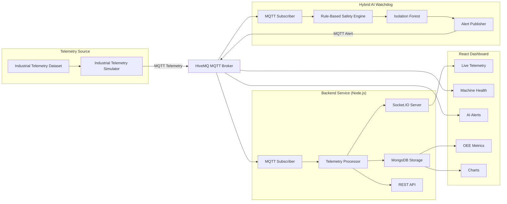

# System Architecture

## Overview

The CNC Digital Twin is designed as a distributed, event-driven system. Instead of relying on continuous access to industrial hardware, it uses an Industrial Telemetry Simulator (ITS) to replay representative CNC laser machine telemetry into an MQTT broker.

The telemetry is consumed by independent backend and machine learning services, allowing each component to operate independently while communicating through MQTT.

---

# Architecture Diagram

---

# Logical Components

The application is divided into five independent services.

## 1. Industrial Telemetry Simulator

Responsibilities

- Read telemetry dataset
- Publish MQTT messages
- Simulate machine operation
- Generate repeatable workloads

---

## 2. MQTT Broker

Responsibilities

- Receive telemetry
- Route messages
- Decouple services

Broker

- HiveMQ Public Broker

---

## 3. Backend Service

Responsibilities

- Subscribe to telemetry
- Validate incoming data
- Store telemetry
- Broadcast live updates
- Expose REST APIs

Technology

- Node.js
- Express
- Socket.IO
- MongoDB

---

## 4. Hybrid AI Watchdog

Responsibilities

- Subscribe to telemetry
- Evaluate rule-based thresholds
- Run Isolation Forest
- Publish anomaly alerts

Detection Strategy

### Rule-Based

- Temperature
- Acceleration
- Gas Pressure

### Machine Learning

- Isolation Forest

---

## 5. React Dashboard

Responsibilities

- Live telemetry
- Charts
- OEE
- Machine Health
- AI Alerts

---

# Why MQTT?

MQTT acts as the communication backbone of the system.

Benefits

- Loose coupling
- Real-time messaging
- Easy service expansion
- Lightweight communication

Any future component can subscribe without modifying existing services.

Examples

- Grafana
- Prometheus Exporter
- Mobile App
- Analytics Engine

---

# Architectural Characteristics

- Event-driven architecture
- Publish/Subscribe messaging
- Independent AI service
- Decoupled frontend and backend
- Replayable telemetry
- Modular design
- Easily extensible