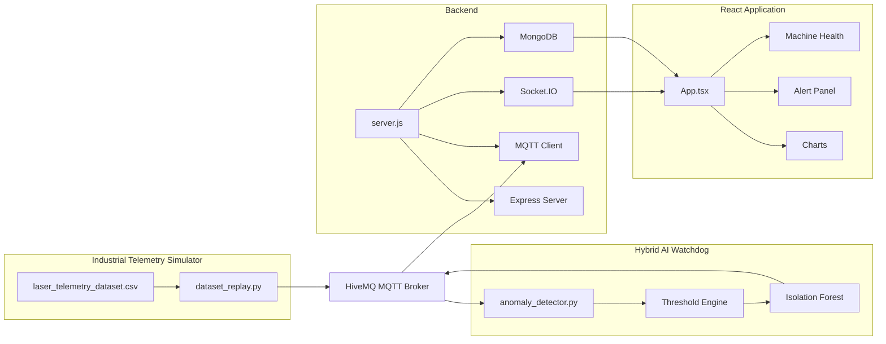

# Component Architecture

## Overview

The CNC Digital Twin consists of five independent components connected through MQTT and WebSocket communication.

Each component has a single responsibility, making the application modular and easy to extend.

---

# Component Diagram



---

# Components

## Industrial Telemetry Simulator

Files

```
ml/

dataset_replay.py

laser_telemetry_dataset.csv
```

Responsibilities

- Read telemetry dataset

- Simulate machine operation

- Publish MQTT messages

- Replay industrial workloads

---

## MQTT Broker

Responsibilities

- Receive telemetry

- Deliver telemetry

- Decouple services

Communication

Publisher

- dataset_replay.py

Subscribers

- server.js

- anomaly_detector.py

---

## Backend

Files

```
backend/

server.js
```

Responsibilities

- MQTT Subscriber

- Socket.IO Server

- REST API

- MongoDB Storage

- Dashboard Communication

---

## Hybrid AI Watchdog

Files

```
ml/

anomaly_detector.py
```

Responsibilities

- Subscribe to telemetry

- Evaluate safety thresholds

- Train Isolation Forest

- Detect anomalies

- Publish alerts

---

## Frontend

Files

```
frontend/src/

App.tsx
```

Responsibilities

- Display telemetry

- Charts

- AI Alerts

- Machine Health

- OEE Dashboard

---

# Design Principles

Every component has one responsibility.

| Component | Responsibility |
|------------|----------------|
| Simulator | Generate telemetry |
| MQTT | Message transport |
| Backend | Process and store telemetry |
| AI Watchdog | Detect faults |
| Dashboard | Visualize system state |

---

# Communication Pattern

The system follows Publish / Subscribe messaging.

```
Simulator

↓

MQTT

↓

Backend

↓

Socket.IO

↓

Dashboard
```

At the same time

```
Simulator

↓

MQTT

↓

AI Watchdog

↓

MQTT Alerts

↓

Dashboard
```

This keeps the backend and AI service independent.