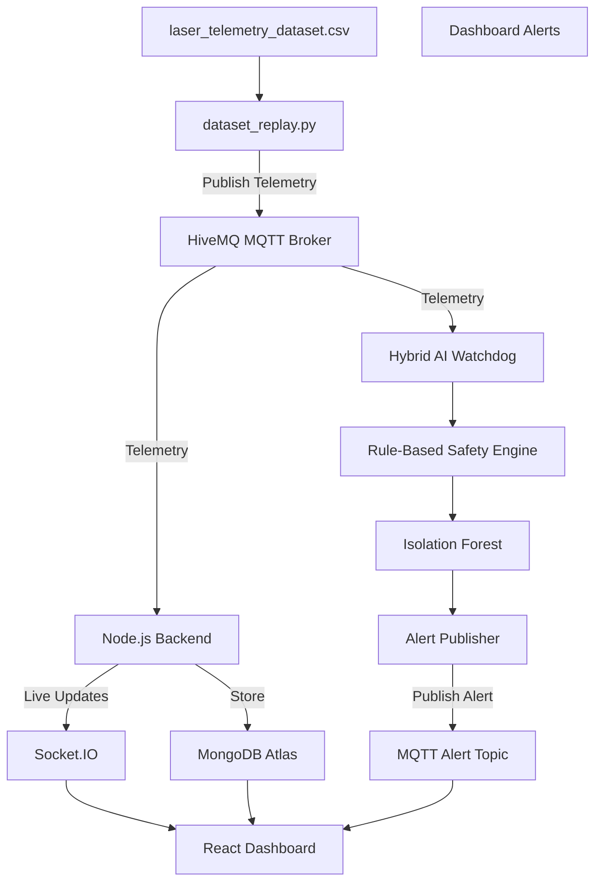

# Data Flow

## Overview

This document explains how telemetry moves through the CNC Digital Twin system from the Industrial Telemetry Simulator to the React dashboard and Hybrid AI Watchdog.

The system follows an event-driven Publish/Subscribe architecture using MQTT as the communication backbone.

---

# End-to-End Data Flow



---

# Step 1 — Dataset Replay

The simulator reads telemetry records from:

```
ml/laser_telemetry_dataset.csv
```

Each record represents one snapshot of machine telemetry.

Example:

```json
{
    "temp":41.5,
    "accel_x":0.24,
    "accel_y":-0.18,
    "air_gas":0.82
}
```

Instead of sending every row immediately, the simulator publishes them one by one to mimic a running CNC machine.

---

# Step 2 — MQTT Publish

The simulator publishes every telemetry record to:

```
griet/cnc/telemetry
```

Publisher

```
dataset_replay.py
```

Subscribers

```
server.js

anomaly_detector.py
```

---

# Step 3 — Backend Processing

The backend receives telemetry from MQTT.

Responsibilities

- Parse JSON
- Validate data
- Store telemetry
- Broadcast live updates

The backend does **not** perform anomaly detection.

Its responsibility is communication and persistence.

---

# Step 4 — Database Storage

Validated telemetry is stored in MongoDB Atlas.

Stored fields include:

- Temperature
- Acceleration X
- Acceleration Y
- Air Gas Pressure
- Machine Status
- Timestamp

Historical telemetry allows the dashboard to display trends over time.

---

# Step 5 — Live Dashboard

The backend immediately broadcasts telemetry using Socket.IO.

The React dashboard receives updates without refreshing the page.

Displayed information includes:

- Live telemetry
- Temperature
- Vibration
- OEE
- Machine status
- Charts

---

# Step 6 — Hybrid AI Watchdog

The AI service independently subscribes to the same MQTT topic.

Unlike the backend, it does not store data.

Instead it analyses incoming telemetry.

Processing pipeline:

Telemetry

↓

Rolling Buffer

↓

Rule-Based Safety Engine

↓

Isolation Forest

↓

Machine Health Evaluation

↓

Alert Generation

---

# Step 7 — Rule-Based Safety Checks

Before using Machine Learning, deterministic safety rules are evaluated.

Examples:

Temperature

```
> 50°C
```

Acceleration

```
> 1.8 G
```

Assist Gas Pressure

```
< 0.6 MPa

or

> 1.2 MPa
```

If any rule is violated, a RED_ALERT is generated immediately.

---

# Step 8 — Isolation Forest

If enough telemetry has been collected:

```
Buffer >= 20 samples
```

the Isolation Forest model is trained using the rolling buffer.

Input Features

- Temperature
- Acceleration X
- Acceleration Y
- Air Gas Pressure

The model identifies abnormal operating patterns that may not exceed predefined thresholds.

This complements the rule-based engine by detecting subtle behavioural changes.

---

# Step 9 — Alert Publishing

When an anomaly is detected, the AI Watchdog publishes an alert.

MQTT Topic

```
griet/cnc/alerts
```

Example

```json
{
  "type":"RED_ALERT",
  "machine":"LASER-001",
  "score":-0.42,
  "reason":"Critical Laser Overheating",
  "timestamp":1720422456
}
```

---

# Step 10 — Dashboard Alert

The dashboard subscribes to the alert topic.

Operators immediately see:

- Alert type
- Machine ID
- Detection score
- Failure reason
- Timestamp

No page refresh is required.

---

# Summary

The complete telemetry lifecycle is:

```
CSV Dataset

↓

Industrial Telemetry Simulator

↓

MQTT Broker

↓

Node.js Backend
        │
        ▼
 MongoDB Atlas
        │
        ▼
 Socket.IO
        │
        ▼
 React Dashboard

        ▲

Hybrid AI Watchdog

↓

Rule Engine

↓

Isolation Forest

↓

MQTT Alerts
```

---

# Design Benefits

- Event-driven communication
- Loose coupling
- Independent AI processing
- Repeatable simulation
- Real-time dashboard updates
- Historical telemetry storage
- Scalable architecture