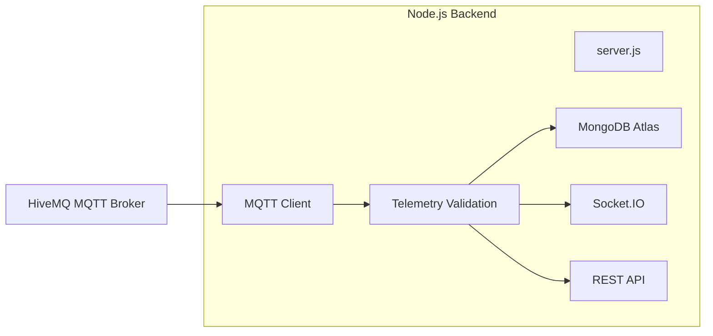
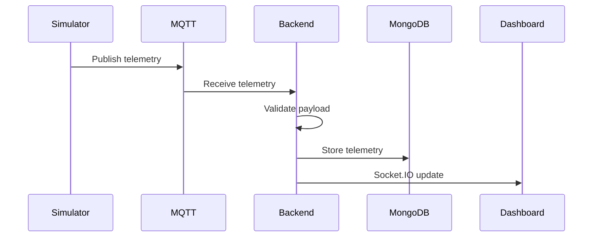

# Backend Architecture

## Overview

The backend acts as the communication hub of the CNC Digital Twin.

It is responsible for:

- Receiving telemetry from the MQTT broker
- Validating incoming data
- Persisting telemetry in MongoDB Atlas
- Broadcasting live updates to connected dashboard clients
- Exposing REST APIs for historical data

The backend does **not** perform anomaly detection. That responsibility belongs to the Hybrid AI Watchdog.

---

# Backend Architecture



---

# Responsibilities

The backend is responsible for communication, persistence, and real-time delivery.

| Responsibility | Description |
|----------------|-------------|
| MQTT Subscriber | Receives telemetry |
| Validation | Parses and validates JSON |
| Storage | Saves telemetry into MongoDB |
| Socket.IO | Broadcasts live telemetry |
| REST API | Returns historical telemetry |

---

# Request Flow



---

# MQTT Subscriber

The backend subscribes to

```

griet/cnc/telemetry

```

Every received message is converted into a JavaScript object.

Example:

```json
{
    "temp":42.5,
    "accel_x":0.14,
    "accel_y":-0.11,
    "air_gas":0.82
}
```

---

# Telemetry Validation

Before processing, the backend verifies:

- JSON is valid
- Required fields exist
- Message is parsable

Invalid messages are ignored to prevent backend crashes.

---

# MongoDB Storage

Telemetry is persisted in MongoDB Atlas.

Typical fields include:

- Temperature
- Acceleration X
- Acceleration Y
- Air Gas Pressure
- Timestamp
- Machine Status

Historical telemetry enables trend visualization and future analytics.

---

# Socket.IO

Once telemetry has been validated, the backend broadcasts it to all connected dashboard clients.

Benefits:

- No page refresh
- Low latency
- Real-time updates
- Multiple dashboard clients supported

---

# REST APIs

The backend exposes REST endpoints for retrieving stored telemetry.

Typical endpoints include:

| Method | Endpoint | Purpose |
|---------|----------|---------|
| GET | /api/history | Historical telemetry |
| GET | /api/latest | Latest telemetry |
| GET | /api/health | Backend health status |

> Update these endpoints to match your implementation if they differ.

---

# Error Handling

The backend is designed to remain operational even when failures occur.

Examples:

### MQTT Disconnect

- Automatic reconnection
- Resume subscriptions

---

### MongoDB Failure

- Log database errors
- Continue receiving MQTT messages
- Resume storage after reconnection

---

### Invalid Telemetry

- Ignore malformed JSON
- Prevent server crashes
- Continue processing subsequent messages

---

# Design Decisions

The backend intentionally does not contain any machine learning logic.

Reasons:

- Clear separation of concerns
- Easier maintenance
- Independent scaling
- Independent deployment
- Simpler testing

The backend focuses solely on receiving, storing, and distributing telemetry.

---

# Technology Stack

- Node.js
- Express
- MQTT.js
- Socket.IO
- MongoDB Atlas

---

# Future Improvements

Potential enhancements include:

- Authentication (JWT)
- API versioning
- Request validation using Joi or Zod
- Structured logging with Winston or Pino
- Docker containerization
- Redis caching
- Rate limiting
- Metrics with Prometheus