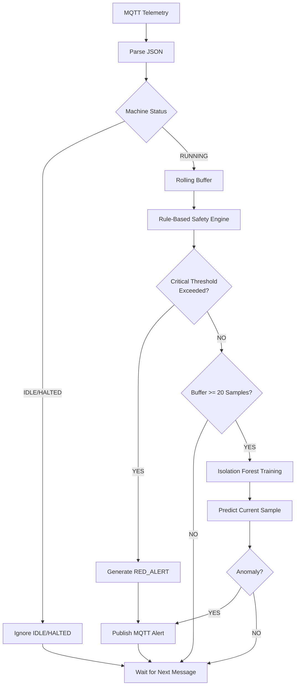

# Hybrid AI Watchdog

## Overview

The Hybrid AI Watchdog is an independent Python service responsible for monitoring incoming CNC telemetry and detecting abnormal machine behaviour.

Unlike a traditional machine learning pipeline, the watchdog combines deterministic industrial safety rules with an Isolation Forest anomaly detection model.

This hybrid approach provides immediate detection of critical failures while also identifying subtle behavioural changes that may indicate early machine degradation.

---

# AI Processing Pipeline



---

# Processing Steps

## Step 1 — Receive Telemetry

The AI Watchdog subscribes to the MQTT telemetry topic.

```
griet/cnc/telemetry
```

Every incoming message is parsed into a Python dictionary.

---

## Step 2 — Machine Status Check

Messages with status:

- IDLE
- HALTED

are ignored because they do not represent active machine operation.

This prevents unnecessary processing.

---

## Step 3 — Rolling Buffer

Each telemetry record is stored inside a rolling buffer.

```python
deque(maxlen=100)
```

The buffer always contains the latest telemetry samples.

---

## Step 4 — Rule-Based Safety Engine

Before machine learning is executed, deterministic industrial safety rules are evaluated.

Current rules include:

### Temperature

| Condition | Action |
|------------|--------|
| >45°C | Elevated Temperature |
| >50°C | Critical Overheating |

---

### Acceleration

Maximum acceleration is calculated using:

```
max(abs(accel_x), abs(accel_y))
```

If:

```
>1.8 G
```

the machine is considered to have experienced violent head motion or a potential collision.

---

### Assist Gas Pressure

Safe operating range:

```
0.6 MPa

↓

1.2 MPa
```

Values outside this range immediately trigger an alert.

---

# Rule Engine Output

If any rule fails:

- Fault detected
- Reason generated
- RED_ALERT published

Machine Learning is not required to detect these critical events.

---

# Isolation Forest

If enough telemetry exists:

```
Rolling Buffer >=20 samples
```

an Isolation Forest model is trained.

Current configuration:

```python
IsolationForest(

    n_estimators=50,

    contamination="auto",

    random_state=42

)
```

Input Features

- Temperature
- Acceleration X
- Acceleration Y
- Assist Gas Pressure

The model evaluates whether the newest telemetry point is statistically different from recent machine behaviour.

---

# AI Decision

The model produces:

Prediction

```
Normal

or

Anomaly
```

Decision Score

```
decision_function()
```

If:

- prediction == -1

AND

- decision score < -0.1

an anomaly alert is generated.

---

# Alert Generation

Example

```json
{
  "type":"RED_ALERT",
  "machine":"LASER-001",
  "score":-0.37,
  "reason":"AI Detected Kinematic/Gas Deviation",
  "timestamp":1720434588
}
```

The alert is published to

```
griet/cnc/alerts
```

---

# Why Hybrid Detection?

Industrial monitoring systems rarely depend on machine learning alone.

Rule-based detection is ideal for known safety limits.

Machine learning complements these rules by identifying abnormal behaviour that may not exceed predefined thresholds.

Combining both approaches reduces false negatives while maintaining fast detection of critical events.

---

# Advantages

- Real-time anomaly detection
- Explainable rule-based decisions
- Statistical anomaly detection
- Independent AI service
- MQTT-based alert publishing
- Easy to extend with additional rules or models

---

# Future Improvements

Potential enhancements include:

- Model persistence instead of retraining on each update
- Feature engineering
- Additional vibration metrics
- Autoencoder-based anomaly detection
- LSTM time-series forecasting
- Online learning
- Model performance monitoring