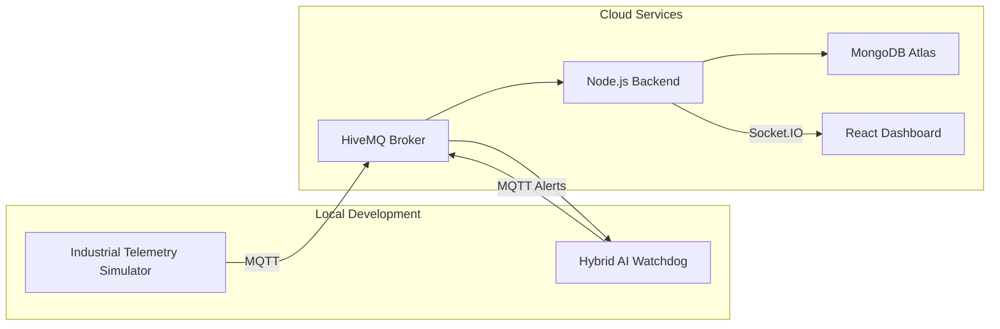

# Deployment Architecture

## Overview

The CNC Digital Twin is deployed as a distributed cloud application. Each component operates independently and communicates using standard protocols such as MQTT, HTTP, and WebSockets.

This architecture allows the frontend, backend, machine learning service, and telemetry simulator to be developed and deployed independently.

---

# Deployment Diagram

---

# Deployment Components

## React Dashboard

Hosting Platform

- Vercel

Responsibilities

- User Interface
- Live Dashboard
- Charts
- Machine Health
- Alerts

---

## Backend

Hosting Platform

- Render

Responsibilities

- MQTT Subscriber
- Socket.IO Server
- REST APIs
- MongoDB Storage

---

## Database

Platform

- MongoDB Atlas

Stores

- Historical telemetry
- Machine metrics

---

## MQTT Broker

Platform

- HiveMQ Public Broker

Responsibilities

- Transport telemetry
- Transport alerts
- Decouple services

---

## AI Watchdog

Runtime

- Python

Responsibilities

- Rule Engine
- Isolation Forest
- Alert Publishing

---

## Industrial Telemetry Simulator

Runtime

- Python

Responsibilities

- Replay telemetry dataset
- Simulate machine behaviour
- Publish MQTT messages

---

# Communication Protocols

| Source | Destination | Protocol |
|---------|-------------|----------|
| Simulator | HiveMQ | MQTT |
| Backend | MongoDB | MongoDB Driver |
| Backend | Dashboard | Socket.IO |
| AI Watchdog | HiveMQ | MQTT |
| Browser | Backend | HTTP |

---

# Scalability

The deployment architecture allows each service to scale independently.

Future improvements include:

- Docker containers
- Kubernetes
- Private MQTT broker
- Redis cache
- Prometheus
- Grafana
- CI/CD pipeline