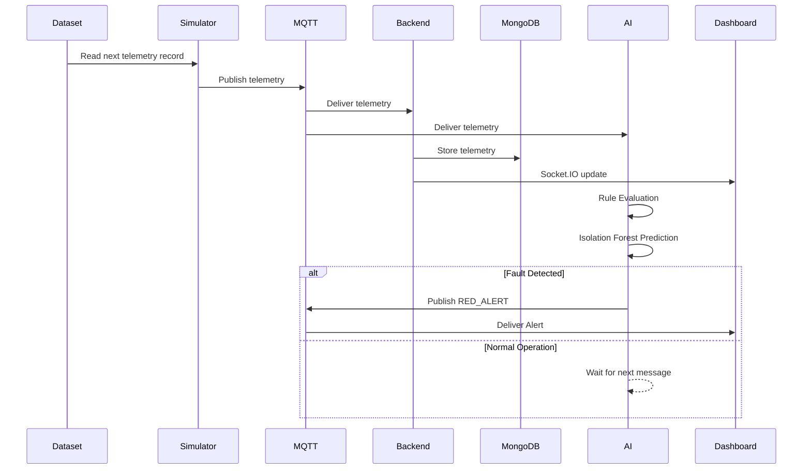

# Sequence Diagram

This document illustrates how telemetry flows through the complete system.

---

---

# Sequence Description

1. The simulator reads the next telemetry record.

2. The telemetry record is published to HiveMQ.

3. Both the backend and AI Watchdog receive the message.

4. The backend stores telemetry in MongoDB.

5. Socket.IO immediately pushes live updates to the dashboard.

6. The AI Watchdog evaluates rule-based thresholds.

7. If enough samples exist, Isolation Forest evaluates the current record.

8. If an anomaly is detected, a RED_ALERT is published.

9. The dashboard immediately displays the alert.